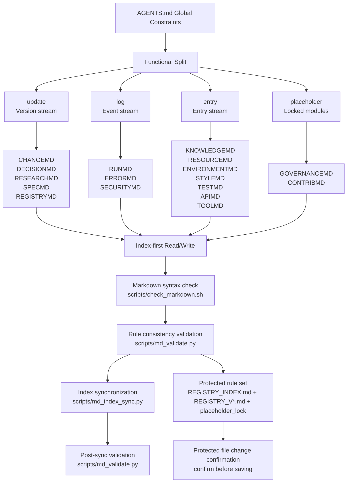
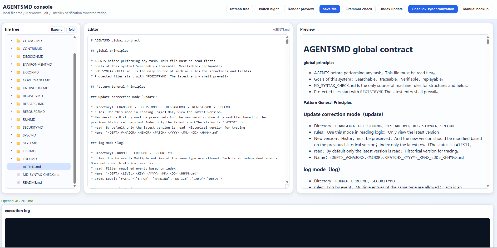

<div align="center">

<h1>AGENTSMD</h1>

<p><strong>Help stateless coding agents read rules, write records, and leave execution evidence through indexes, templates, and synchronized validation</strong></p>

<p>
  
  
  
  
  <a href=".github/workflows/agentsmd-ci.yml"></a>
</p>

<p>
  <a href="#project-snapshot">Snapshot</a> ·
  <a href="AGENTSMD_CN/README.md">Chinese docs</a> ·
  <a href="AGENTSMD_EN/README.md">English docs</a> ·
  <a href="CHANGELOG.md">Changelog</a> ·
  <a href="SECURITY.md">Security</a>
</p>

<p><a href="README.md">简体中文</a> · <a href="README.en.md">English</a></p>

</div>

<a id="project-snapshot"></a>

## 1 Project snapshot

This section separates the former combined bilingual document into a Chinese primary README and an English mirror while preserving its features, workflows, commands, screenshot slots, and adoption boundaries

<div align="center">

Table 1.1 Public project overview

| Item | Current value |
|---|---|
| Chinese workspace | [`AGENTSMD_CN`](AGENTSMD_CN/README.md) |
| English workspace | [`AGENTSMD_EN`](AGENTSMD_EN/README.md) |
| Content modes | `update`, `log`, `entry`, and locked placeholder modules |
| Validation chain | Syntax, rule consistency, index synchronization, and post-sync validation |
| Visualization | Repository-local web console |
| License and security | [`LICENSE`](LICENSE) and [`SECURITY.md`](SECURITY.md) |

</div>

## 2 What Is AGENTSMD

AGENTSMD is a documentation operating system for coding agents.

Goal: even a stateless agent can work correctly by reading rules,
indexes, and templates, then writing back in a predictable format.

## 3 Why It Exists

Most agent failures come from drift:

- Context drift: constraints are forgotten.
- Format drift: records become inconsistent.
- Execution drift: same task, different structure.

AGENTSMD reduces this drift with strict read/write contracts.

## 4 How It Works

<div align="center">



Figure 4.1 Rule documents, execution modes, and the validation loop

</div>

### 4.1 Three Core Files

- `AGENTS.md`: global contract, naming rules, modes, workflows.
- `*_TEMPLATE.md`: required section structure for each department.
- `*_INDEX.md`: retrieval entry point; always read this first.

### 4.2 Three Data Modes

- `update`: version stream, keep history, read latest first.
  Departments: `CHANGEMD`, `DECISIONMD`, `RESEARCHMD`,
  `SPECMD`, `REGISTRYMD`.
- `log`: event stream, each incident is independent.
  Departments: `RUNMD`, `ERRORMD`, `SECURITYMD`.
- `entry`: entry stream, update existing key records.
  Departments: `KNOWLEDGEMD`, `RESOURCEMD`, `ENVIRONMENTMD`,
  `STYLEMD`, `TESTMD`, `APIMD`, `TOOLMD`.
- `placeholder`: locked modules for future extension.
  Departments: `GOVERNANCEMD`, `CONTRIBMD`.

### 4.3 Department Role Map

- `CHANGEMD`: records implemented change facts, why they were made,
  and what was observed after execution.
- `DECISIONMD`: records architecture-level and strategy-level decisions,
  including decision rationale and rejected alternatives.
- `RESEARCHMD`: records market movement, competitor shifts, and external
  context changes that may affect planning.
- `SPECMD`: records evolving goals, PRD boundaries, and technical
  specification baselines for execution.
- `REGISTRYMD`: records protected files/paths and defines where external
  confirmation is mandatory before modification.
- `RUNMD`: records runtime and operations incidents, responses, and
  recovery outcomes for production stability.
- `ERRORMD`: records engineering-side failures
  (build/compile/dependency/test) with root cause and fix.
- `SECURITYMD`: records confirmed attack events and response actions,
  and links to related RUNMD/ERRORMD entries.
- `KNOWLEDGEMD`: records reusable technical concepts, principles, paper
  notes, and methods for fast agent understanding.
- `RESOURCEMD`: records only resource pointers (URL or local absolute
  path), not resource bodies.
- `ENVIRONMENTMD`: records operating environment facts such as OS,
  runtime, dependency, and baseline compatibility.
- `STYLEMD`: records suffix-based writing/coding/comment rules to keep
  output style consistent.
- `TESTMD`: records testing standards, scope, toolchain, and acceptance
  gates for quality control.
- `APIMD`: records internal/external API endpoints, auth usage, quota,
  and maintenance details.
- `TOOLMD`: records local tool executables, usage commands, and
  operational boundaries.
- `GOVERNANCEMD`: reserved and locked placeholder for future
  multi-agent governance policies.
- `CONTRIBMD`: reserved and locked placeholder for future
  multi-agent collaboration policies.

## 5 How to Extend Departments

When you add a new department, follow this sequence:

1. Pick a mode: `update`, `log`, `entry`, or `placeholder`.
2. Create the folder in both `AGENTSMD_CN` and `AGENTSMD_EN`.
3. Add `*_TEMPLATE.md` and `*_INDEX.md`, then add one sample entry.
4. Update the machine rules in `MD_SYNTAX_CHECK.md`:
   - add to `active_departments` or `placeholder_departments`
   - add `departments.<DEPT>` config
   - define `mode`, `template`, `index`, `filename_regex`
   - define `required_sections`, `metadata_required`, `index_columns`
5. Update `AGENTS.md`:
   - add the department into mode definitions
   - add one-line role description
   - add workflow links if the department is in active flow
6. If it is a placeholder department, update `placeholder_lock.files`
   hashes in `MD_SYNTAX_CHECK.md`.
7. Run validation:
   - `bash scripts/md_sync.sh` (full regression, run once at task end)

Rule of thumb: scripts should stay generic; extend by rules, not by
hardcoding names in Python.

## 6 How to Initialize in a Project

Use this minimal onboarding sequence:

1. Copy one workspace (`AGENTSMD_EN` or `AGENTSMD_CN`) into the target
   repository root and rename it to `AGENTSMD`.
2. Run one full sync to generate baseline index content.
3. Install AGENTSMD CI workflow in the target repository.

Example:

```bash
# run in target repository root
cp -r /path/to/AGENTSMD/AGENTSMD_EN ./AGENTSMD # Perform the operation described in this section
bash AGENTSMD/scripts/md_sync.sh # Perform the operation described in this section
python3 AGENTSMD/scripts/install_ci_workflow.py --repo-root . # Perform the operation described in this section
```

## 7 Starter Prompt Template (First Task)

Use this prompt when an agent starts from zero memory:

```markdown
# Use the following content as one complete prompt
# The following paragraph continues this task specification
You are working in <repository path>. We are onboarding AGENTSMD to maintain the project as the only rule source.
Below are your tasks
1. Read AGENTSMD/AGENTS.md, understand rules and workflows, and strictly follow mode/workflow execution afterwards
2. Run a detailed full-project investigation
* repository structure and core modules
* tech stack, dependencies, scripts, CI
* API, deployment path, testing system, risk hotspots
* any other necessary information
3. Output a project cognition summary.
4. Initialize AGENTSMD departments naturally as needed
* only initialize required departments, mainly to supplement project cognition
* check REGISTRY protected paths before every write
5. Record real onboarding changes into CHANGEMD.
6. Run first full validation; normally run once at task end
* bash AGENTSMD/scripts/md_sync.sh


# The following paragraph continues this task specification
User Tasks:
* Deploy the latest CN/EN versions from https://github.com/AIALRA-0/AGENTSMD.git into our project directory
* <describe user task here>
* .....


# The following paragraph continues this task specification
This Round Output
* project investigation summary
* AGENTSMD initialization actions
* files read
* files changed
* validation summary
* final execution status
```

## 8 Daily Task Prompt Template

```markdown
# The following label separates one task section in this prompt
Section 1: AGENTSMD is your only behavior rule source and execution protocol
You can assume you are a stateless Agent, and all operations must be closed-loop
Each round must follow: read index → write by template → Workflow Trace → md_sync validation

# The following label separates one task section in this prompt
Section 2: Execution Notes
1. Before the task starts, you must read the following files
* AGENTS.md explains global modes, workflows, and department responsibilities
* REGISTRYMD/REGISTRY_INDEX.md explains protected paths

# The following paragraph continues this task specification
2. Use Workflow Trace during the task
* Before each workflow round starts, run Workflow cleanup precheck first. Check whether historical `RUN_INFO_WORKFLOW_*` trace files exist in the current change set, ensure this round has only one workflow trace candidate; if multiple are found, clean first and then continue
* Select the best-matching workflow_id from MD_SYNTAX_CHECK.md workflow_enforcement.catalog
* Create/update one record in RUNMD: RUN_INFO_WORKFLOW_*.md
* Fully fill in ## Workflow Trace JSON in that file, without omissions
* Strictly follow status rules based on the read/write permission architecture

# The following paragraph continues this task specification
3. Before task completion, you must run validation once and only once, unless errors require reruns
* bash AGENTSMD/scripts/md_sync.sh

# The following paragraph continues this task specification
4. Your writing must be plain and easy to understand, not obscure, not overly brief, and with enough detail and explanation to clearly report every key point

# The following label separates one task section in this prompt
Section 3: User Tasks in This Round
* user task 1
* user task 2
* user task 3


# The following label separates one task section in this prompt
Section 4: Report Output
Use exactly this structure
1. Workflow Trace selection
2. Workflow Trace execution status
3. Task execution summary
* completed items list
* key decisions list
4. File operation record list
5. Workflow bottlenecks and optimization suggestions
6. md_sync.sh validation result
7. Final execution status
```

## 9 Quick Start

### 9.1 Validate Chinese workspace

```bash
# Run the following commands in the order shown for this section
cd AGENTSMD_CN # Perform the operation described in this section
bash scripts/md_sync.sh # Perform the operation described in this section
```

### 9.2 Validate English workspace

```bash
# Run the following commands in the order shown for this section
cd AGENTSMD_EN # Perform the operation described in this section
bash scripts/md_sync.sh # Perform the operation described in this section
```

### 9.3 Open local visual console

```bash
# Run the following commands in the order shown for this section
cd AGENTSMD_CN # Perform the operation described in this section
bash run_agentsmd_web.sh # Perform the operation described in this section
```

## 10 Workflow Trace

Workflow Trace is the execution protocol that turns workflow rules
into verifiable evidence:

1. Select one `workflow_id` from `MD_SYNTAX_CHECK.md`
   (`workflow_enforcement.catalog`) before doing work.
2. Create one `RUN_INFO_WORKFLOW_*` record in `RUNMD` for this task.
3. Fill `## Workflow Trace` JSON with:
   `workflow_id`, `task_id`, `reason`, and full `steps[]`.
4. For each step, report:
   `step_id`, `department`, `status`, `evidence`, `note`.
5. Status rules:
   `must_read` must be `READ_ONLY` or `CHANGED`;
   `must_write` must be `CHANGED` with real department diff;
   `optional_write` may use `SKIPPED_JUSTIFIED` only when allowed and with a reason.
6. Enforcement:
   local `md_sync.sh` runs strict guard (blocks on missing steps);
   CI runs report-only guard (warns and guides completion).

## 11 CI and Downstream Usage

Root CI auto-discovers every `AGENTSMD*` directory and runs:

1. Markdown syntax check (`check_markdown.sh`)
2. Rule consistency validation (`md_validate.py`)
3. Index synchronization (`md_index_sync.py`)
4. Post-sync validation (`md_validate.py`)

Install this CI into another repository:

```bash
# Run the following commands in the order shown for this section
python3 AGENTSMD_CN/scripts/install_ci_workflow.py --repo-root /path/to/target-repo # Perform the operation described in this section
```

or

```bash
# Run the following commands in the order shown for this section
python3 AGENTSMD_EN/scripts/install_ci_workflow.py --repo-root /path/to/target-repo # Perform the operation described in this section
```

## 12 Screenshot

<div align="center">



Figure 12.1 AGENTSMD local visual console

</div>

## 13 FAQ

**Q: Why keep both CN and EN directories?**

A: It keeps bilingual collaboration consistent under the same structure
and rules.

[Back to language navigation](#project-snapshot)

---
