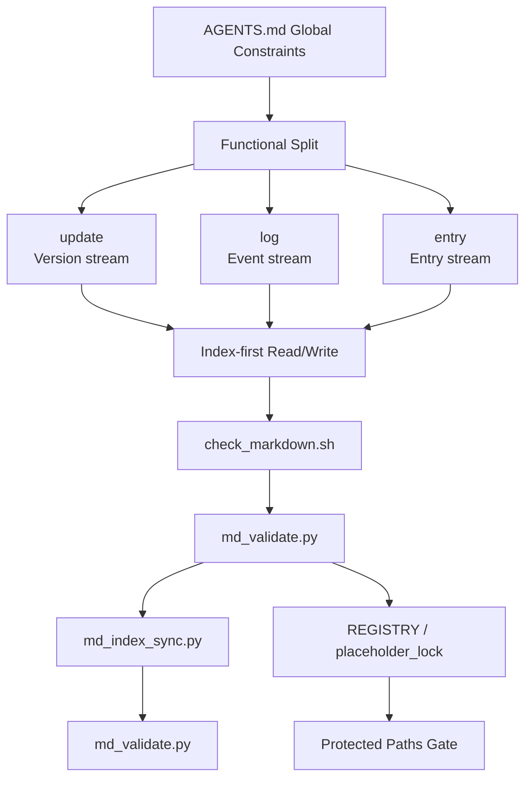
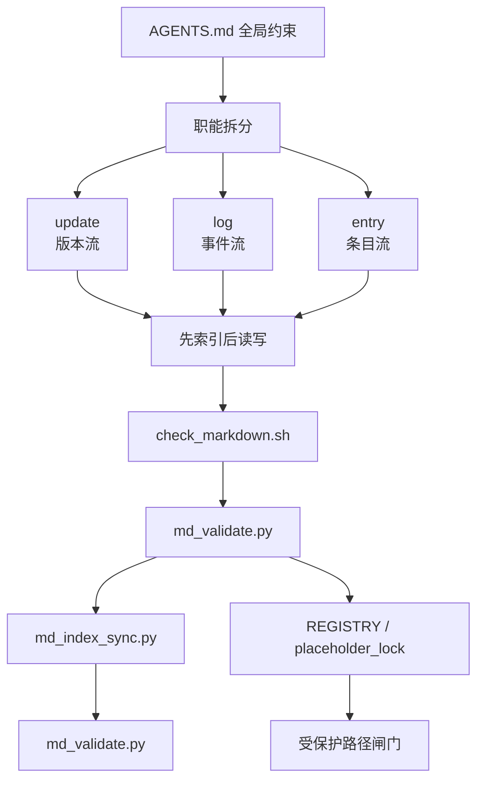

# AGENTSMD

[](https://github.com/AIALRA-0/AGENTSMD/actions/workflows/agentsmd-ci.yml)


[](./AGENTSMD_CN/README.md)
[](./AGENTSMD_EN/README.md)

## Language Navigation

- [English](#english)
- [中文](#中文)

---

## English

### What Is AGENTSMD

AGENTSMD is a documentation operating system for coding agents.

Goal: even a stateless agent can work correctly by reading rules,
indexes, and templates, then writing back in a predictable format.

### Why It Exists

Most agent failures come from drift:

- Context drift: constraints are forgotten.
- Format drift: records become inconsistent.
- Execution drift: same task, different structure.

AGENTSMD reduces this drift with strict read/write contracts.

### How It Works



#### Three Core Files

- `AGENTS.md`: global contract, naming rules, modes, workflows.
- `*_TEMPLATE.md`: required section structure for each department.
- `*_INDEX.md`: retrieval entry point; always read this first.

#### Three Data Modes

- `update`: version stream, keep history, read latest first.
- `log`: event stream, each incident is independent.
- `entry`: key-based records, update existing key records.

### Department Map (One Line Each)

- `CHANGEMD`: implementation-level change history.
- `DECISIONMD`: architecture and strategy decisions (ADR).
- `RESEARCHMD`: market, competitor, and context updates.
- `SPECMD`: goals, PRD, and technical specification updates.
- `REGISTRYMD`: protected paths that require external confirmation.
- `RUNMD`: runtime/operations incidents and recovery actions.
- `ERRORMD`: engineering failures in build/compile/test/dependency.
- `SECURITYMD`: confirmed attack incidents and response actions.
- `KNOWLEDGEMD`: reusable concepts, principles, papers, methods.
- `RESOURCEMD`: URL/local-path pointers for external resources.
- `ENVIRONMENTMD`: environment facts (OS/runtime/dependency).
- `STYLEMD`: suffix-based writing, naming, and comment rules.
- `TESTMD`: testing standards, tools, scopes, acceptance criteria.
- `APIMD`: API usage, endpoints, auth/token, and maintenance notes.
- `TOOLMD`: local tool path, command, and usage boundaries.
- `GOVERNANCEMD`: locked placeholder for future governance rules.
- `CONTRIBMD`: locked placeholder for future collaboration rules.

### Quick Start

#### 1) Validate Chinese workspace

```bash
cd AGENTSMD_CN
bash scripts/md_sync.sh
```

#### 2) Validate English workspace

```bash
cd AGENTSMD_EN
bash scripts/md_sync.sh
```

#### 3) Open local visual console

```bash
cd AGENTSMD_CN
bash run_agentsmd_web.sh
```

### CI and Downstream Usage

Root CI auto-discovers every `AGENTSMD*` directory and runs:

1. `check_markdown.sh`
2. `md_validate.py`
3. `md_index_sync.py`
4. `md_validate.py`

Install this CI into another repository:

```bash
python3 AGENTSMD_CN/scripts/install_ci_workflow.py \
  --repo-root /path/to/target-repo
```

or

```bash
python3 AGENTSMD_EN/scripts/install_ci_workflow.py \
  --repo-root /path/to/target-repo
```

### Screenshot


### FAQ

**Q: Why keep both CN and EN directories?**

A: It keeps bilingual collaboration consistent under the same structure
and rules.

[Back to language navigation](#language-navigation)

---

## 中文

### AGENTSMD 是什么

AGENTSMD 是一套给编码 Agent 用的文档操作系统。

目标很简单：就算 Agent 没有长期记忆，也能靠规则、索引、模板
稳定执行，并把结果写回统一格式。

### 为什么要做它

Agent 常见失败，基本都来自三类漂移：

- 上下文漂移：约束被忘记。
- 格式漂移：记录越写越乱。
- 执行漂移：同一任务每次输出结构都不同。

AGENTSMD 的作用，就是把这三类漂移压下来。

### 它怎么运作



#### 三个核心文件

- `AGENTS.md`：全局合同，定义模式、命名、工作流和边界。
- `*_TEMPLATE.md`：定义该部门条目必须有什么章节。
- `*_INDEX.md`：检索入口，必须先读索引再读正文。

#### 三种数据模式

- `update`：版本流，保留历史，默认先读最新。
- `log`：事件流，每条事件独立，不覆盖历史。
- `entry`：按 Key 维护条目，已有 Key 直接更新。

### 部门一句话说明

- `CHANGEMD`：记录实现层变更历史。
- `DECISIONMD`：记录架构与策略决策（ADR）。
- `RESEARCHMD`：记录市场、竞品和背景修正。
- `SPECMD`：记录目标、PRD 与技术规格演进。
- `REGISTRYMD`：记录受保护路径，命中后需外部确认。
- `RUNMD`：记录运行时/运维事件与处置过程。
- `ERRORMD`：记录构建/编译/依赖/测试类工程错误。
- `SECURITYMD`：记录确认攻击事件与响应动作。
- `KNOWLEDGEMD`：记录可复用概念、原理、论文、方法。
- `RESOURCEMD`：记录外部资源 URL 或本地绝对路径。
- `ENVIRONMENTMD`：记录环境事实（系统/运行时/依赖）。
- `STYLEMD`：记录按后缀划分的写作与代码风格规则。
- `TESTMD`：记录测试标准、范围、工具与验收条件。
- `APIMD`：记录 API 端点、鉴权、用法与维护信息。
- `TOOLMD`：记录本地工具路径、命令与使用边界。
- `GOVERNANCEMD`：占位目录，已锁定，预留治理规则。
- `CONTRIBMD`：占位目录，已锁定，预留协作规则。

### 快速开始

#### 1）校验中文目录

```bash
cd AGENTSMD_CN
bash scripts/md_sync.sh
```

#### 2）校验英文目录

```bash
cd AGENTSMD_EN
bash scripts/md_sync.sh
```

#### 3）启动本地可视化控制台

```bash
cd AGENTSMD_CN
bash run_agentsmd_web.sh
```

### CI 与下放接入

根目录 CI 会自动发现所有 `AGENTSMD*` 目录，并执行：

1. `check_markdown.sh`
2. `md_validate.py`
3. `md_index_sync.py`
4. `md_validate.py`

把这套 CI 安装到其他仓库：

```bash
python3 AGENTSMD_CN/scripts/install_ci_workflow.py \
  --repo-root /path/to/target-repo
```

或

```bash
python3 AGENTSMD_EN/scripts/install_ci_workflow.py \
  --repo-root /path/to/target-repo
```

### 截图


### 常见问题

**问：为什么保留 CN 和 EN 两套目录？**

答：为了双语协作时仍保持同构、同规则、同校验链路。

[返回语言导航](#language-navigation)
