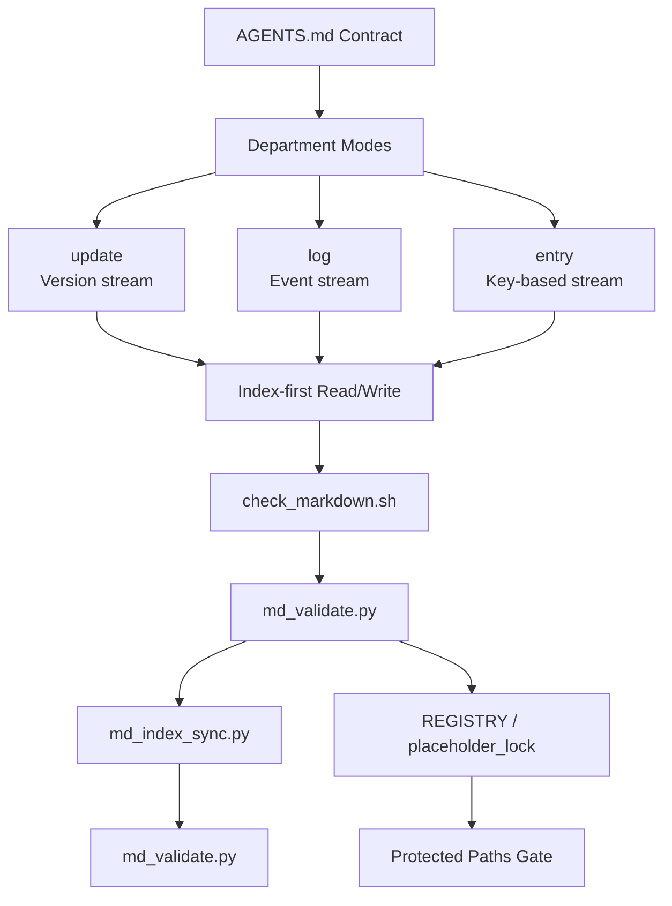

# AGENTSMD

## Agent-Native Documentation Operating System

Stateless agents can still work reliably through rules, indexes,
and verifiable workflows.

[](https://github.com/AIALRA-0/AGENTSMD/actions/workflows/agentsmd-ci.yml)


[](./AGENTSMD_CN/README.md)
[](./AGENTSMD_EN/README.md)

---

## Why AGENTSMD

AGENTSMD solves one core problem:
**how to make coding agents reliable without long-term memory**.

Most agent failures come from drift:

- context drift (forgets prior constraints)
- format drift (inconsistent records)
- execution drift (different runs produce different structure)

AGENTSMD turns this into deterministic operations by combining:

1. strict folder contracts
2. index-first access
3. mode-aware writing rules (`update` / `log` / `entry`)
4. automated validation and index synchronization

---

## Architecture



### Core Layers

- **Contract Layer**: `AGENTS.md` + `MD_SYNTAX_CHECK.md`
- **Mode Layer**: `update`, `log`, `entry`
- **Department Layer**: SPEC / RESEARCH / DECISION / CHANGE / RUN / ERROR
  / SECURITY / ...
- **Validation Layer**: lint + schema + index consistency
- **Protection Layer**: protected path registry + placeholder lock hashes

---

## Capabilities

- **Index-Driven Access**: agents read index first, then target records.
- **Traceable Evolution**: meaningful changes are captured by mode rules.
- **Deterministic Validation**: write flows end in mandatory checks.
- **Cross-Project Deployability**: AGENTSMD can be dropped into other repos.
- **Bilingual Operations**: CN/EN structures stay aligned.

---

## Potential

AGENTSMD is infrastructure, not just docs:

- for solo builders: company-grade traceability in one-person projects
- for multi-agent teams: shared contracts with lower execution entropy
- for organizations: convert tacit process into verifiable operations

---

## Quick Start

### Validate CN

```bash
cd AGENTSMD_CN
bash scripts/md_sync.sh
```

### Validate EN

```bash
cd AGENTSMD_EN
bash scripts/md_sync.sh
```

### Local Visual Console

```bash
cd AGENTSMD_CN
bash run_agentsmd_web.sh
```

(English mirror is also available under `AGENTSMD_EN`.)

---

## CI and Downstream Integration

This repository includes a root GitHub Actions workflow that:

1. auto-discovers all `AGENTSMD*` directories
2. validates each target with the same 4-step pipeline
3. fails on unsynced index changes

To install the same CI in another repository after dropping AGENTSMD in:

```bash
python3 AGENTSMD_CN/scripts/install_ci_workflow.py \
  --repo-root /path/to/target-repo
```

or

```bash
python3 AGENTSMD_EN/scripts/install_ci_workflow.py \
  --repo-root /path/to/target-repo
```

---

## Screenshots (Placeholders)

Replace these paths with real images when ready.


---

## FAQ

**Q1: Why keep both CN and EN directories?**
A: To keep operational parity while enabling bilingual contributors.

**Q2: Do agents need memory to use this?**
A: No. AGENTSMD is designed for stateless execution.

**Q3: What guarantees consistency?**
A: `check_markdown` + `md_validate` + `md_index_sync` + `md_validate`,
enforced in CI.
