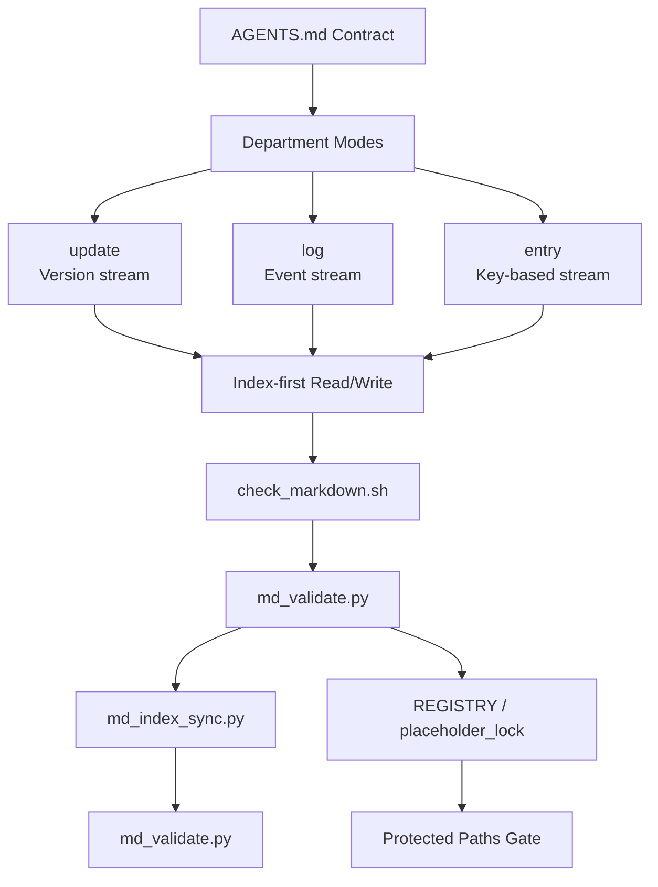

# AGENTSMD

## Agent-Native Documentation Operating System · 面向 Agent 的文档操作系统

Stateless agents can still work reliably through rules, indexes,
and verifiable workflows.

无长期记忆的 Agent，也能依靠规则、索引和可验证流程稳定工作。

[](https://github.com/AIALRA-0/AGENTSMD/actions/workflows/agentsmd-ci.yml)


[](./AGENTSMD_CN/README.md)
[](./AGENTSMD_EN/README.md)

---

## Table of Contents

- [Why AGENTSMD / 初衷](#why-agentsmd--初衷)
- [Architecture / 架构](#architecture--架构)
- [Capabilities / 功能](#capabilities--功能)
- [Potential / 潜力](#potential--潜力)
- [Quick Start / 快速开始](#quick-start--快速开始)
- [CI and Downstream / CI 与下放接入](#ci-and-downstream--ci-与下放接入)
- [Screenshots Placeholders / 图片占位](#screenshots-placeholders--图片占位)

---

## Why AGENTSMD / 初衷

AGENTSMD solves one core problem:
**how to make coding agents reliable without long-term memory**.

AGENTSMD 解决一个核心问题：
**如何让无长期记忆的编码 Agent 也能稳定执行**。

Most agent failures come from drift:

- context drift (forgets prior constraints)
- format drift (inconsistent records)
- execution drift (different runs produce different structure)

常见失败来自三类漂移：

- 上下文漂移（忘约束）
- 格式漂移（记录不一致）
- 执行漂移（同任务输出结构不一致）

---

## Architecture / 架构



### Core Layers / 核心层次

- **Contract Layer**: `AGENTS.md` + `MD_SYNTAX_CHECK.md`
- **Mode Layer**: `update`, `log`, `entry`
- **Department Layer**: SPEC / RESEARCH / DECISION / CHANGE / RUN / ERROR
  / SECURITY / ...
- **Validation Layer**: lint + schema + index consistency
- **Protection Layer**: protected path registry + placeholder lock hashes

---

## Capabilities / 功能

- **Index-Driven Access / 索引驱动访问**:
  read index first, then target records.
- **Traceable Evolution / 可追溯演进**:
  meaningful changes are captured by mode rules.
- **Deterministic Validation / 确定性校验**:
  write flows end in mandatory checks.
- **Cross-Project Deployability / 可下放到任意项目**:
  AGENTSMD can be dropped into other repos.
- **Bilingual Operations / 双语协作**:
  CN/EN structures stay aligned.

---

## Potential / 潜力

AGENTSMD is infrastructure, not just docs.

AGENTSMD 是基础设施，不只是文档。

- for solo builders: company-grade traceability
- for multi-agent teams: shared contracts, lower entropy
- for organizations: tacit process -> verifiable operations

- 对个人：获得公司级可追溯能力
- 对多 Agent：共享契约、降低执行熵
- 对组织：把隐性流程转成可验证操作

---

## Quick Start / 快速开始

### Validate CN

```bash
cd AGENTSMD_CN
bash scripts/md_sync.sh
```

### Validate EN

```bash
cd AGENTSMD_EN
bash scripts/md_sync.sh
```

### Local Visual Console / 本地可视化控制台

```bash
cd AGENTSMD_CN
bash run_agentsmd_web.sh
```

(English mirror is available under `AGENTSMD_EN`.)

---

## CI and Downstream / CI 与下放接入

Root workflow auto-discovers every `AGENTSMD*` directory and runs:

1. `check_markdown.sh`
2. `md_validate.py`
3. `md_index_sync.py`
4. `md_validate.py`

根目录 workflow 会自动发现所有 `AGENTSMD*` 目录并执行同一校验链。

Install this CI into another repository:

```bash
python3 AGENTSMD_CN/scripts/install_ci_workflow.py \
  --repo-root /path/to/target-repo
```

or

```bash
python3 AGENTSMD_EN/scripts/install_ci_workflow.py \
  --repo-root /path/to/target-repo
```

---

## Screenshots Placeholders / 图片占位

Replace these paths with real images when ready.

后续把占位图替换为真实截图即可。


---

## FAQ

**Q: Why keep both CN and EN directories?**

A: To keep operational parity while enabling bilingual contributors.

**问：为什么保留 CN 与 EN 两套目录？**

答：保证双语协作时仍能保持同构与同规则运行。
