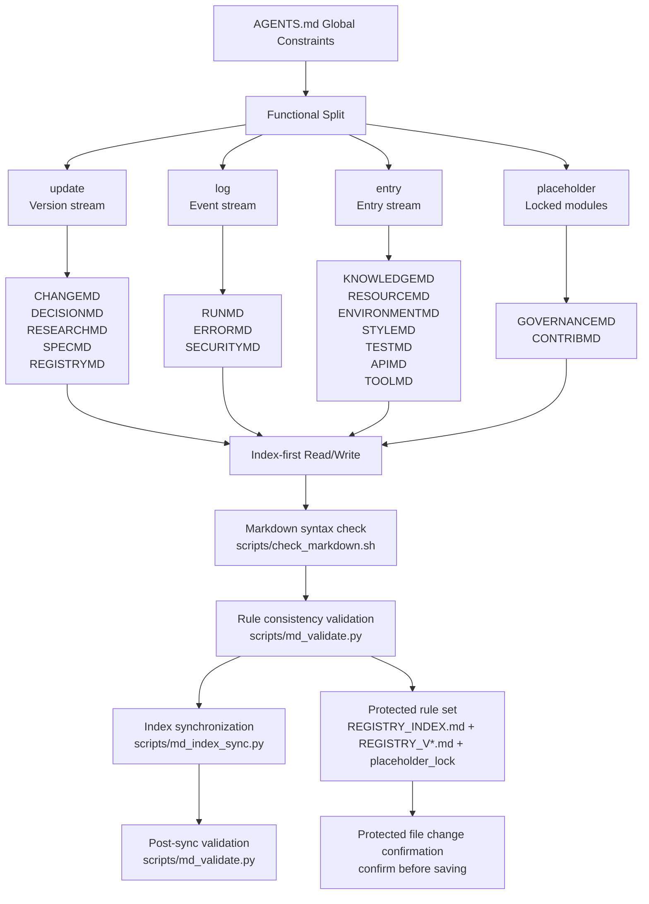
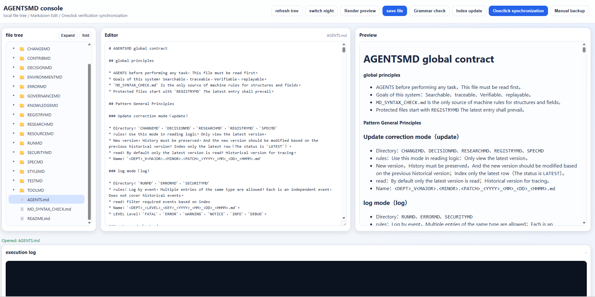
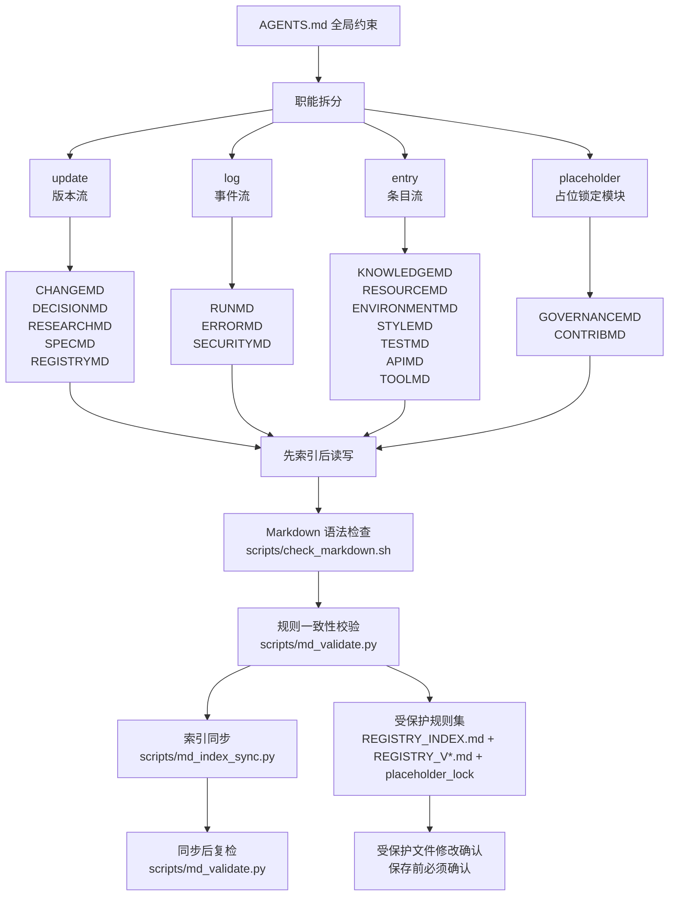
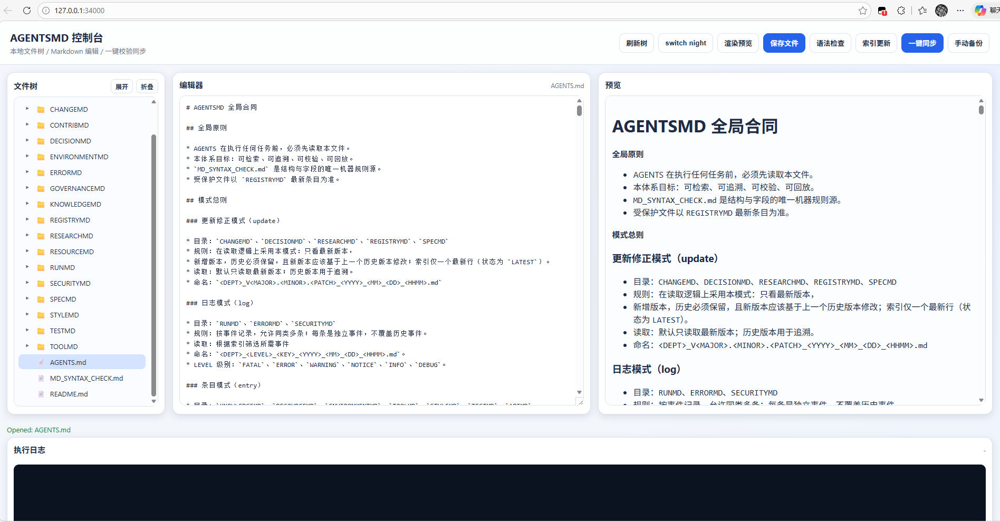

# AGENTSMD

[](https://github.com/AIALRA-0/AGENTSMD/actions/workflows/agentsmd-ci.yml)


[](./AGENTSMD_CN/README.md)
[](./AGENTSMD_EN/README.md)

## Language Navigation

- [English](#english)
- [中文](#中文)

---

## English

### What Is AGENTSMD

AGENTSMD is a documentation operating system for coding agents.

Goal: even a stateless agent can work correctly by reading rules,
indexes, and templates, then writing back in a predictable format.

### Why It Exists

Most agent failures come from drift:

- Context drift: constraints are forgotten.
- Format drift: records become inconsistent.
- Execution drift: same task, different structure.

AGENTSMD reduces this drift with strict read/write contracts.

### How It Works



#### Three Core Files

- `AGENTS.md`: global contract, naming rules, modes, workflows.
- `*_TEMPLATE.md`: required section structure for each department.
- `*_INDEX.md`: retrieval entry point; always read this first.

#### Three Data Modes

- `update`: version stream, keep history, read latest first.
  Departments: `CHANGEMD`, `DECISIONMD`, `RESEARCHMD`,
  `SPECMD`, `REGISTRYMD`.
- `log`: event stream, each incident is independent.
  Departments: `RUNMD`, `ERRORMD`, `SECURITYMD`.
- `entry`: entry stream, update existing key records.
  Departments: `KNOWLEDGEMD`, `RESOURCEMD`, `ENVIRONMENTMD`,
  `STYLEMD`, `TESTMD`, `APIMD`, `TOOLMD`.
- `placeholder`: locked modules for future extension.
  Departments: `GOVERNANCEMD`, `CONTRIBMD`.

#### Department Role Map

- `CHANGEMD`: records implemented change facts, why they were made,
  and what was observed after execution.
- `DECISIONMD`: records architecture-level and strategy-level decisions,
  including decision rationale and rejected alternatives.
- `RESEARCHMD`: records market movement, competitor shifts, and external
  context changes that may affect planning.
- `SPECMD`: records evolving goals, PRD boundaries, and technical
  specification baselines for execution.
- `REGISTRYMD`: records protected files/paths and defines where external
  confirmation is mandatory before modification.
- `RUNMD`: records runtime and operations incidents, responses, and
  recovery outcomes for production stability.
- `ERRORMD`: records engineering-side failures
  (build/compile/dependency/test) with root cause and fix.
- `SECURITYMD`: records confirmed attack events and response actions,
  and links to related RUNMD/ERRORMD entries.
- `KNOWLEDGEMD`: records reusable technical concepts, principles, paper
  notes, and methods for fast agent understanding.
- `RESOURCEMD`: records only resource pointers (URL or local absolute
  path), not resource bodies.
- `ENVIRONMENTMD`: records operating environment facts such as OS,
  runtime, dependency, and baseline compatibility.
- `STYLEMD`: records suffix-based writing/coding/comment rules to keep
  output style consistent.
- `TESTMD`: records testing standards, scope, toolchain, and acceptance
  gates for quality control.
- `APIMD`: records internal/external API endpoints, auth usage, quota,
  and maintenance details.
- `TOOLMD`: records local tool executables, usage commands, and
  operational boundaries.
- `GOVERNANCEMD`: reserved and locked placeholder for future
  multi-agent governance policies.
- `CONTRIBMD`: reserved and locked placeholder for future
  multi-agent collaboration policies.

### How to Extend Departments

When you add a new department, follow this sequence:

1. Pick a mode: `update`, `log`, `entry`, or `placeholder`.
2. Create the folder in both `AGENTSMD_CN` and `AGENTSMD_EN`.
3. Add `*_TEMPLATE.md` and `*_INDEX.md`, then add one sample entry.
4. Update the machine rules in `MD_SYNTAX_CHECK.md`:
   - add to `active_departments` or `placeholder_departments`
   - add `departments.<DEPT>` config
   - define `mode`, `template`, `index`, `filename_regex`
   - define `required_sections`, `metadata_required`, `index_columns`
5. Update `AGENTS.md`:
   - add the department into mode definitions
   - add one-line role description
   - add workflow links if the department is in active flow
6. If it is a placeholder department, update `placeholder_lock.files`
   hashes in `MD_SYNTAX_CHECK.md`.
7. Run validation:
   - `bash scripts/md_sync.sh --scope <DEPT>`
   - `bash scripts/md_sync.sh` (full regression)

Rule of thumb: scripts should stay generic; extend by rules, not by
hardcoding names in Python.

### How to Initialize in a Project

Use this minimal onboarding sequence:

1. Copy one workspace (`AGENTSMD_EN` or `AGENTSMD_CN`) into the target
   repository root and rename it to `AGENTSMD`.
2. Run one full sync to generate baseline index content.
3. Install AGENTSMD CI workflow in the target repository.

Example:

```bash
# run in target repository root
cp -r /path/to/AGENTSMD/AGENTSMD_EN ./AGENTSMD
bash AGENTSMD/scripts/md_sync.sh
python3 AGENTSMD/scripts/install_ci_workflow.py --repo-root .
```

### Starter Prompt Template (First Task)

Use this prompt when an agent starts from zero memory:

```text
You are working in this repository. AGENTSMD is the only rule source.
1) Read AGENTSMD/AGENTS.md and follow its mode/workflow rules.
2) Run a full project investigation:
   - repository structure and key modules
   - runtime stack, dependencies, scripts, and CI
   - APIs, deployment path, test setup, and risk hotspots
3) Build a concise project understanding report.
4) Initialize AGENTSMD naturally and only as needed:
   - create/update department baselines that are actually required
   - avoid unnecessary mass writes
   - always check REGISTRY protected paths before writing
5) Record real onboarding changes in CHANGEMD.
6) Validate after changes:
   - bash AGENTSMD/scripts/md_sync.sh --scope <DEPT> (scoped)
   - bash AGENTSMD/scripts/md_sync.sh (full)

Task:
<describe task here>

Output format:
- project reconnaissance summary
- AGENTSMD initialization plan (which departments and why)
- files read
- files changed
- validation output summary
- final status (success/fail + reason)
```

### Quick Start

#### 1) Validate Chinese workspace

```bash
cd AGENTSMD_CN
bash scripts/md_sync.sh
```

#### 2) Validate English workspace

```bash
cd AGENTSMD_EN
bash scripts/md_sync.sh
```

#### 3) Open local visual console

```bash
cd AGENTSMD_CN
bash run_agentsmd_web.sh
```

### Workflow Trace

Workflow Trace is the execution protocol that turns workflow rules
into verifiable evidence:

1. Select one `workflow_id` from `MD_SYNTAX_CHECK.md`
   (`workflow_enforcement.catalog`) before doing work.
2. Create one `RUN_INFO_WORKFLOW_*` record in `RUNMD` for this task.
3. Fill `## Workflow Trace` JSON with:
   `workflow_id`, `task_id`, `reason`, and full `steps[]`.
4. For each step, report:
   `step_id`, `department`, `status`, `evidence`, `note`.
5. Status rules:
   `must_read` must be `READ_ONLY` or `CHANGED`;
   `must_write` must be `CHANGED` with real department diff;
   `optional_write` may use `SKIPPED_JUSTIFIED` only when allowed and with a reason.
6. Enforcement:
   local `md_sync.sh` runs strict guard (blocks on missing steps);
   CI runs report-only guard (warns and guides completion).

### CI and Downstream Usage

Root CI auto-discovers every `AGENTSMD*` directory and runs:

1. Markdown syntax check (`check_markdown.sh`)
2. Rule consistency validation (`md_validate.py`)
3. Index synchronization (`md_index_sync.py`)
4. Post-sync validation (`md_validate.py`)

Install this CI into another repository:

```bash
python3 AGENTSMD_CN/scripts/install_ci_workflow.py \
  --repo-root /path/to/target-repo
```

or

```bash
python3 AGENTSMD_EN/scripts/install_ci_workflow.py \
  --repo-root /path/to/target-repo
```

### Screenshot



### FAQ

**Q: Why keep both CN and EN directories?**

A: It keeps bilingual collaboration consistent under the same structure
and rules.

[Back to language navigation](#language-navigation)

---

## 中文

### AGENTSMD 是什么

AGENTSMD 是一套给编码 Agent 用的文档操作系统。

目标很简单：就算 Agent 没有长期记忆，也能靠规则、索引、模板
稳定执行，并把结果写回统一格式。

### 为什么要做它

Agent 常见失败，基本都来自三类漂移：

- 上下文漂移：约束被忘记。
- 格式漂移：记录越写越乱。
- 执行漂移：同一任务每次输出结构都不同。

AGENTSMD 的作用，就是把这三类漂移压下来。

### 它怎么运作



#### 三个核心文件

- `AGENTS.md`：全局合同，定义模式、命名、工作流和边界。
- `*_TEMPLATE.md`：定义该部门条目必须有什么章节。
- `*_INDEX.md`：检索入口，必须先读索引再读正文。

#### 三种数据模式

- `update`：版本流，保留历史，默认先读最新。
  部门：`CHANGEMD`、`DECISIONMD`、`RESEARCHMD`、
  `SPECMD`、`REGISTRYMD`。
- `log`：事件流，每条事件独立，不覆盖历史。
  部门：`RUNMD`、`ERRORMD`、`SECURITYMD`。
- `entry`：条目流，已有 Key 直接更新。
  部门：`KNOWLEDGEMD`、`RESOURCEMD`、`ENVIRONMENTMD`、
  `STYLEMD`、`TESTMD`、`APIMD`、`TOOLMD`。
- `placeholder`：占位并锁定，预留后续扩展。
  部门：`GOVERNANCEMD`、`CONTRIBMD`。

#### 部门职责说明

- `CHANGEMD`：记录“已经真实落地”的改动事实、改动原因与改后观察，
  是执行链路可追溯的主线记录。
- `DECISIONMD`：记录架构级与策略级决策，明确为何采纳该方案以及
  为什么放弃其他候选方案。
- `RESEARCHMD`：记录市场、竞品、行业背景等外部变化，保证规划输入
  基于最新证据而不是主观假设。
- `SPECMD`：记录目标、PRD 边界和技术规格基线，为实现、测试、发布
  提供统一约束。
- `REGISTRYMD`：记录受保护文件与路径，定义哪些修改必须先经过外部确认。
- `RUNMD`：记录运行时/运维事件、处置动作与恢复结果，用于提升系统稳定性。
- `ERRORMD`：记录构建/编译/依赖/测试类工程错误，沉淀根因、修复与防再发机制。
- `SECURITYMD`：记录已确认攻击事件与安全响应动作，并联动 RUNMD/ERRORMD
  形成完整证据链。
- `KNOWLEDGEMD`：记录可复用概念、原理、论文解读与方法论，帮助 Agent
  快速理解复杂技术背景。
- `RESOURCEMD`：只记录资源定位信息（URL 或本地绝对路径），不重复存放资源正文。
- `ENVIRONMENTMD`：记录环境事实（系统、运行时、依赖、兼容基线），用于排障与复现。
- `STYLEMD`：记录按后缀划分的写作/代码/注释风格规则，保证输出风格一致。
- `TESTMD`：记录测试标准、覆盖范围、工具链与验收门槛，约束质量闭环。
- `APIMD`：记录内外 API 的端点、鉴权、配额与维护信息，降低接口接入和变更风险。
- `TOOLMD`：记录本地工具可执行路径、调用方式与使用边界，确保执行可复现。
- `GOVERNANCEMD`：预留并锁定的占位目录，后续用于多 Agent 治理规则。
- `CONTRIBMD`：预留并锁定的占位目录，后续用于多 Agent 协作流程规则。

### 如何扩展部门

新增部门时，按这个顺序执行：

1. 先确定模式：`update`、`log`、`entry` 或 `placeholder`。
2. 在 `AGENTSMD_CN` 和 `AGENTSMD_EN` 同步创建目录。
3. 新增 `*_TEMPLATE.md`、`*_INDEX.md`，再放一条样例条目。
4. 更新 `MD_SYNTAX_CHECK.md` 的机器规则块：
   - 写入 `active_departments` 或 `placeholder_departments`
   - 新增 `departments.<DEPT>` 配置
   - 定义 `mode`、`template`、`index`、`filename_regex`
   - 定义 `required_sections`、`metadata_required`、`index_columns`
5. 更新 `AGENTS.md`：
   - 在模式定义中加入该部门
   - 增加部门一句话职责
   - 如果进入主流程，补充对应工作流路径
6. 若是占位部门，更新 `MD_SYNTAX_CHECK.md` 里的
   `placeholder_lock.files` 哈希。
7. 执行校验：
   - `bash scripts/md_sync.sh --scope <DEPT>`
   - `bash scripts/md_sync.sh`（全量回归）

原则：脚本保持通用化，扩展优先改规则，不在 Python 里硬编码部门名。

### 如何初始化到项目中

建议按最小接入流程：

1. 把一个工作区（`AGENTSMD_EN` 或 `AGENTSMD_CN`）复制到目标
   仓库根目录，并重命名为 `AGENTSMD`。
2. 先执行一次全量同步，生成初始索引基线。
3. 安装 AGENTSMD 的 CI workflow。

示例：

```bash
# 在目标仓库根目录执行
cp -r /path/to/AGENTSMD/AGENTSMD_CN ./AGENTSMD
bash AGENTSMD/scripts/md_sync.sh
python3 AGENTSMD/scripts/install_ci_workflow.py --repo-root .
```

### 初始提示词模板（第一条任务）

当 Agent 没有记忆时，直接用这段提示词：

```text
你在当前仓库工作，AGENTSMD 是唯一规则源。
1）读取 AGENTSMD/AGENTS.md，并严格按模式和工作流执行。
2）对整个项目做详细调查：
   - 仓库结构与核心模块
   - 技术栈、依赖、脚本、CI
   - API、部署路径、测试体系、风险热点
3）输出项目认知摘要。
4）按需自然初始化 AGENTSMD：
   - 只初始化必要部门基线，禁止无意义批量写入
   - 写入前必须检查 REGISTRY 受保护路径
5）把真实接入变更记录到 CHANGEMD。
6）执行校验：
   - bash AGENTSMD/scripts/md_sync.sh --scope <DEPT>（单部门）
   - bash AGENTSMD/scripts/md_sync.sh（全量）

当前任务：
<在这里描述任务>

输出格式：
- 项目调查摘要
- AGENTSMD 初始化计划（哪些部门、原因是什么）
- 已读取文件
- 已修改文件
- 校验输出摘要
- 最终状态（成功/失败 + 原因）
```

### 快速开始

#### 1）校验中文目录

```bash
cd AGENTSMD_CN
bash scripts/md_sync.sh
```

#### 2）校验英文目录

```bash
cd AGENTSMD_EN
bash scripts/md_sync.sh
```

#### 3）启动本地可视化控制台

```bash
cd AGENTSMD_CN
bash run_agentsmd_web.sh
```

Workflow Trace

Workflow Trace 是把“工作流规则”变成“可校验执行证据”的核心机制：

1. 开始任务前，先从 `MD_SYNTAX_CHECK.md` 的
   `workflow_enforcement.catalog` 选择一个 `workflow_id`。
2. 每个任务必须在 `RUNMD` 新增一条 `RUN_INFO_WORKFLOW_*` 记录。
3. 在 `## Workflow Trace` 中填写 JSON，至少包含：
   `workflow_id`、`task_id`、`reason`、`steps[]`。
4. 每个步骤必须写清：
   `step_id`、`department`、`status`、`evidence`、`note`。
5. 状态判定规则：
   `must_read` 只能是 `READ_ONLY/CHANGED`；
   `must_write` 必须是 `CHANGED` 且对应部门有真实改动；
   `optional_write` 仅在允许时可用 `SKIPPED_JUSTIFIED`，且必须写理由。
6. 执行策略：
   本地 `md_sync.sh` 走严格拦截（缺步骤直接失败）；
   CI 走反馈模式（给 warning 和补全建议，不直接阻断）。

### CI 与下放接入

根目录 CI 会自动发现所有 `AGENTSMD*` 目录，并执行：

1. Markdown 语法检查（`check_markdown.sh`）
2. 规则一致性校验（`md_validate.py`）
3. 索引同步（`md_index_sync.py`）
4. 同步后复检（`md_validate.py`）

把这套 CI 安装到其他仓库：

```bash
python3 AGENTSMD_CN/scripts/install_ci_workflow.py \
  --repo-root /path/to/target-repo
```

或

```bash
python3 AGENTSMD_EN/scripts/install_ci_workflow.py \
  --repo-root /path/to/target-repo
```

### 截图



### 常见问题

**问：为什么保留 CN 和 EN 两套目录？**

答：为了双语协作时仍保持同构、同规则、同校验链路。

[返回语言导航](#language-navigation)
