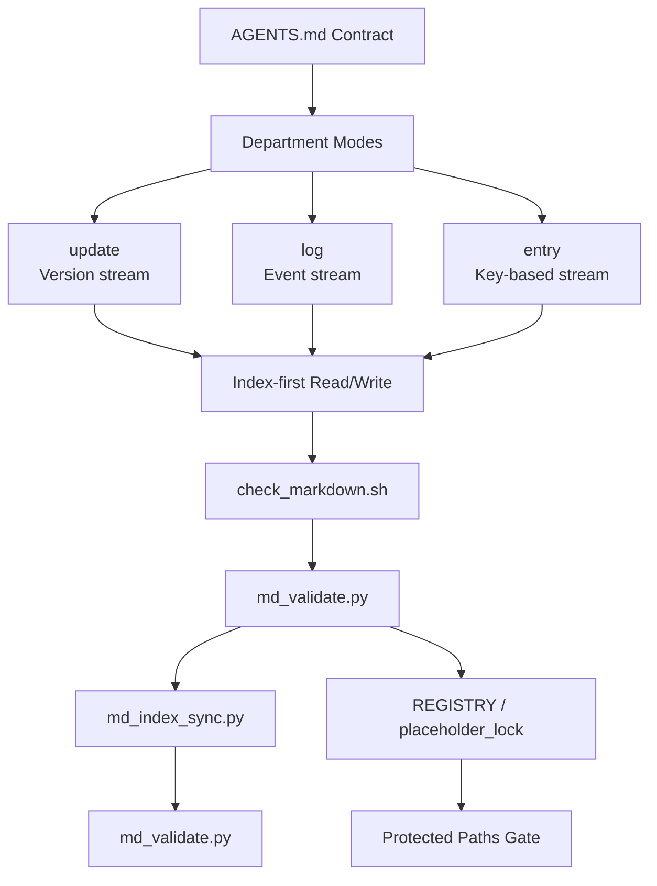
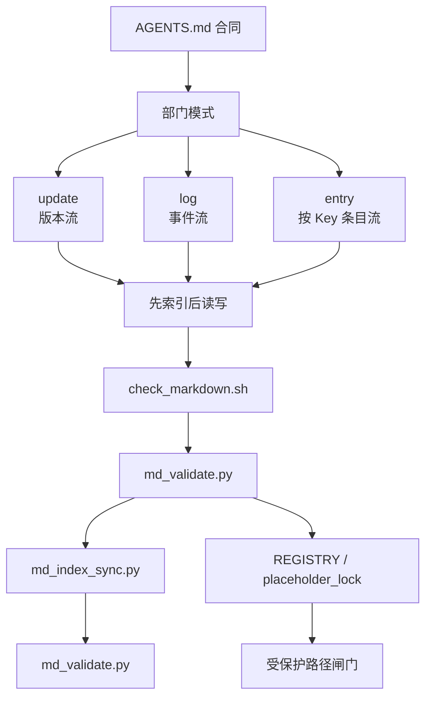

# AGENTSMD

[](https://github.com/AIALRA-0/AGENTSMD/actions/workflows/agentsmd-ci.yml)


[](./AGENTSMD_CN/README.md)
[](./AGENTSMD_EN/README.md)

## Language Navigation

- [English](#english)
- [中文](#中文)

---

## English

### Agent-Native Documentation Operating System

Stateless agents can still work reliably through rules, indexes,
and verifiable workflows.

### Table of Contents

- [Why AGENTSMD](#why-agentsmd)
- [Architecture](#architecture)
- [Mini AGENTS Contract](#mini-agents-contract)
- [Capabilities](#capabilities)
- [Potential](#potential)
- [Quick Start](#quick-start)
- [CI and Downstream Usage](#ci-and-downstream-usage)
- [Screenshots Placeholders](#screenshots-placeholders)
- [FAQ](#faq)

### Why AGENTSMD

AGENTSMD solves one core problem:
**how to make coding agents reliable without long-term memory**.

Most agent failures come from drift:

- Context drift (forgets prior constraints)
- Format drift (inconsistent records)
- Execution drift (different runs produce different structure)

### Architecture



#### Core Layers

- **Contract Layer**: `AGENTS.md` + rules file
- **Mode Layer**: `update`, `log`, `entry`
- **Department Layer**: SPEC / RESEARCH / DECISION / CHANGE / RUN / ERROR
  / SECURITY / ...
- **Validation Layer**: lint + schema + index consistency
- **Protection Layer**: protected path registry + placeholder lock hashes

### Mini AGENTS Contract

#### Core Document Roles

- **`AGENTS.md`**: defines modes, naming, workflows, boundaries,
  and protection rules.
- **`*_TEMPLATE.md`**: defines mandatory sections and writing format
  for each department.
- **`*_INDEX.md`**: defines retrieval entries and is always read first
  before opening records.

#### Department One-Line Map

- **`CHANGEMD`**: records implementation-level change history in
  versioned update stream.
- **`DECISIONMD`**: records architecture and strategy decisions (ADR)
  in versioned update stream.
- **`RESEARCHMD`**: records market, competitor, and context updates in
  versioned update stream.
- **`SPECMD`**: records evolving goals, PRD, and technical spec
  baselines in versioned update stream.
- **`REGISTRYMD`**: records protected files and paths that require
  external confirmation.
- **`RUNMD`**: records runtime and operations incidents as independent
  timestamped events.
- **`ERRORMD`**: records non-ops engineering failures
  (build/compile/dependency/test) as events.
- **`SECURITYMD`**: records confirmed attack events and response
  actions with mandatory linkage.
- **`KNOWLEDGEMD`**: records reusable concepts, principles, papers, and
  methods by Key-based entries.
- **`RESOURCEMD`**: records external/local resource pointers
  (URL or absolute path) by Key-based entries.
- **`ENVIRONMENTMD`**: records environment facts (OS/runtime/dependency
  baselines) by Key-based entries.
- **`STYLEMD`**: records file-suffix style rules for writing, naming,
  and comments.
- **`TESTMD`**: records test and evaluation standards, scopes, tools,
  and acceptance rules.
- **`APIMD`**: records internal/external API usage, endpoints, tokens,
  quotas, and maintenance notes.
- **`TOOLMD`**: records local tools with executable path, usage,
  and operational boundaries.
- **`GOVERNANCEMD`**: placeholder module kept locked for future
  multi-agent governance rules.
- **`CONTRIBMD`**: placeholder module kept locked for future
  collaboration process rules.

### Capabilities

- **Index-driven access**: read index first, then target records.
- **Traceable evolution**: meaningful changes are captured by mode rules.
- **Deterministic validation**: write flows end in mandatory checks.
- **Cross-project deployability**: AGENTSMD can be dropped into other repositories.
- **Bilingual operations**: CN/EN structures stay aligned.

### Potential

AGENTSMD is infrastructure, not just docs.

- For solo builders: company-grade traceability
- For multi-agent teams: shared contracts, lower entropy
- For organizations: tacit process -> verifiable operations

### Quick Start

#### Validate CN

```bash
cd AGENTSMD_CN
bash scripts/md_sync.sh
```

#### Validate EN

```bash
cd AGENTSMD_EN
bash scripts/md_sync.sh
```

#### Local Visual Console

```bash
cd AGENTSMD_CN
bash run_agentsmd_web.sh
```

An English mirror is available under `AGENTSMD_EN`.

### CI and Downstream Usage

The root workflow auto-discovers every `AGENTSMD*` directory and runs:

1. `check_markdown.sh`
2. `md_validate.py`
3. `md_index_sync.py`
4. `md_validate.py`

Install this CI into another repository:

```bash
python3 AGENTSMD_CN/scripts/install_ci_workflow.py \
  --repo-root /path/to/target-repo
```

or

```bash
python3 AGENTSMD_EN/scripts/install_ci_workflow.py \
  --repo-root /path/to/target-repo
```

### Screenshots Placeholders

Replace these paths with real images when ready.


### FAQ

**Q: Why keep both CN and EN directories?**

A: To keep operational parity while enabling bilingual contributors.

[Back to language navigation](#language-navigation)

---

## 中文

### 面向 Agent 的文档操作系统

无长期记忆的 Agent，也能依靠规则、索引和可验证流程稳定工作。

### 目录

- [项目初衷](#项目初衷)
- [架构](#架构)
- [AGENTS 缩小版合同](#agents-缩小版合同)
- [能力](#能力)
- [潜力](#潜力)
- [快速开始](#快速开始)
- [CI 与下放接入](#ci-与下放接入)
- [图片占位](#图片占位)
- [常见问题](#常见问题)

### 项目初衷

AGENTSMD 解决一个核心问题：**如何让无长期记忆的编码 Agent 也能稳定执行**。

常见失败来自三类漂移：

- 上下文漂移（忘约束）
- 格式漂移（记录不一致）
- 执行漂移（同任务输出结构不一致）

### 架构



#### 核心层次

- **合同层**：`AGENTS.md` + 规则文件
- **模式层**：`update`、`log`、`entry`
- **部门层**：SPEC / RESEARCH / DECISION / CHANGE / RUN / ERROR / SECURITY / ...
- **校验层**：lint + 结构校验 + 索引一致性
- **保护层**：受保护路径清单 + 占位目录哈希锁

### AGENTS 缩小版合同

#### 核心文件职责

- **`AGENTS.md`**：定义模式、命名、工作流、边界与保护规则。
- **`*_TEMPLATE.md`**：定义该部门条目必填章节与写作格式。
- **`*_INDEX.md`**：定义检索入口，读条目前必须先读索引。

#### 部门一句话说明

- **`CHANGEMD`**：记录实现层面的变更历史，采用版本化更新流。
- **`DECISIONMD`**：记录架构与策略决策（ADR），采用版本化更新流。
- **`RESEARCHMD`**：记录市场、竞品与背景修正，采用版本化更新流。
- **`SPECMD`**：记录项目目标、PRD 与技术规格演进，采用版本化更新流。
- **`REGISTRYMD`**：记录受保护文件与路径，命中后必须外部确认。
- **`RUNMD`**：记录运行时与运维事件，每条为独立时间事件。
- **`ERRORMD`**：记录非运维工程错误（构建/编译/依赖/测试）事件。
- **`SECURITYMD`**：记录已确认攻击事件与响应动作，并强制联动记录。
- **`KNOWLEDGEMD`**：按 Key 记录可复用概念、原理、论文与方法论。
- **`RESOURCEMD`**：按 Key 记录资源定位信息（URL 或本地绝对路径）。
- **`ENVIRONMENTMD`**：按 Key 记录环境事实（系统/运行时/依赖基线）。
- **`STYLEMD`**：按文件后缀记录写作、命名与注释风格规则。
- **`TESTMD`**：按 Key 记录测试与评估标准、范围、工具与验收规则。
- **`APIMD`**：按 Key 记录内外 API 端点、用法、凭据与维护信息。
- **`TOOLMD`**：按 Key 记录本地工具路径、调用方式与使用边界。
- **`GOVERNANCEMD`**：占位模块，当前锁定，预留多 Agent 治理规则。
- **`CONTRIBMD`**：占位模块，当前锁定，预留多 Agent 协作流程规则。

### 能力

- **索引驱动访问**：先读索引，再读条目。
- **可追溯演进**：关键修改受模式规则约束并可追踪。
- **确定性校验**：每次写入都以强制校验闭环结束。
- **可下放到任意项目**：AGENTSMD 可以直接接入其他仓库。
- **双语协作**：CN/EN 结构保持同构。

### 潜力

AGENTSMD 是基础设施，不只是文档。

- 对个人：获得公司级可追溯能力
- 对多 Agent：共享契约、降低执行熵
- 对组织：把隐性流程转成可验证操作

### 快速开始

#### 校验中文目录

```bash
cd AGENTSMD_CN
bash scripts/md_sync.sh
```

#### 校验英文目录

```bash
cd AGENTSMD_EN
bash scripts/md_sync.sh
```

#### 启动本地可视化控制台

```bash
cd AGENTSMD_CN
bash run_agentsmd_web.sh
```

英文镜像目录位于 `AGENTSMD_EN`。

### CI 与下放接入

根目录 workflow 会自动发现所有 `AGENTSMD*` 目录，并执行以下链路：

1. `check_markdown.sh`
2. `md_validate.py`
3. `md_index_sync.py`
4. `md_validate.py`

把该 CI 安装到其他仓库：

```bash
python3 AGENTSMD_CN/scripts/install_ci_workflow.py \
  --repo-root /path/to/target-repo
```

或

```bash
python3 AGENTSMD_EN/scripts/install_ci_workflow.py \
  --repo-root /path/to/target-repo
```

### 图片占位

后续把占位图替换为真实截图即可。


### 常见问题

**问：为什么保留 CN 与 EN 两套目录？**

答：保证双语协作时仍能保持同构与同规则运行。

[返回语言导航](#language-navigation)
