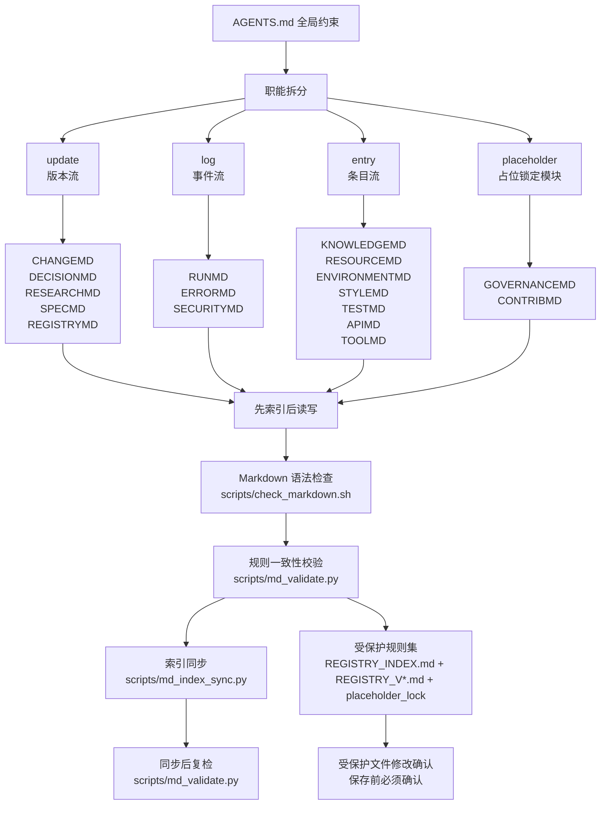
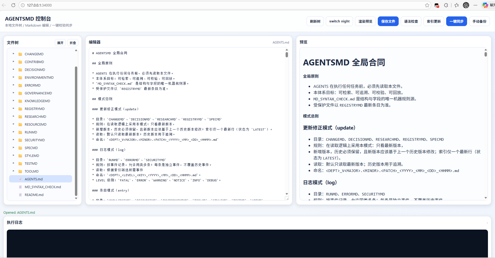

<div align="center">

<h1>AGENTSMD</h1>

<p><strong>让无状态编码 Agent 依靠索引、模板和同步校验稳定读取规则、写回记录并留下执行证据</strong></p>

<p>
  
  
  
  
  <a href=".github/workflows/agentsmd-ci.yml"></a>
</p>

<p>
  <a href="#project-snapshot">项目概览</a> ·
  <a href="AGENTSMD_CN/README.md">中文文档</a> ·
  <a href="AGENTSMD_EN/README.md">英文文档</a> ·
  <a href="CHANGELOG.md">更新记录</a> ·
  <a href="SECURITY.md">安全</a>
</p>

<p><a href="README.md">简体中文</a> · <a href="README.en.md">English</a></p>

</div>

<a id="project-snapshot"></a>

## 1 项目概览

本节把原有双语长文档拆成中文主文档和英文镜像，原有功能、流程、命令、截图槽位和采用边界继续保留

<div align="center">

表 1.1 项目公开概览

| 项目 | 当前内容 |
|---|---|
| 中文工作区 | [`AGENTSMD_CN`](AGENTSMD_CN/README.md) |
| 英文工作区 | [`AGENTSMD_EN`](AGENTSMD_EN/README.md) |
| 内容模式 | `update`、`log`、`entry` 和锁定占位模块 |
| 校验链路 | 语法检查、规则一致性、索引同步和同步后复检 |
| 可视化 | 仓库内本地 Web 控制台 |
| 许可证与安全 | [`LICENSE`](LICENSE) 和 [`SECURITY.md`](SECURITY.md) |

</div>

## 2 系统定位

AGENTSMD 是一套给编码 Agent 用的文档操作系统

目标很简单：就算 Agent 没有长期记忆，也能靠规则、索引、模板
稳定执行，并把结果写回统一格式

## 3 设计目标

Agent 常见失败，基本都来自三类漂移：

- 上下文漂移：约束被忘记
- 格式漂移：记录越写越乱
- 执行漂移：同一任务每次输出结构都不同

AGENTSMD 的作用，就是把这三类漂移压下来

## 4 运行机制

<div align="center">


```mermaid
%% 展示规则文档怎样驱动执行、记录和校验
flowchart TD
  A[AGENTS.md 全局约束] --> B[职能拆分]
  B --> B1[update<br/>版本流]
  B --> B2[log<br/>事件流]
  B --> B3[entry<br/>条目流]
  B --> BP[placeholder<br/>占位锁定模块]
  B1 --> U1[CHANGEMD<br/>DECISIONMD<br/>RESEARCHMD<br/>SPECMD<br/>REGISTRYMD]
  B2 --> U2[RUNMD<br/>ERRORMD<br/>SECURITYMD]
  B3 --> U3[KNOWLEDGEMD<br/>RESOURCEMD<br/>ENVIRONMENTMD<br/>STYLEMD<br/>TESTMD<br/>APIMD<br/>TOOLMD]
  BP --> U4[GOVERNANCEMD<br/>CONTRIBMD]
  U1 --> C[先索引后读写]
  U2 --> C
  U3 --> C
  U4 --> C
  C --> D[Markdown 语法检查<br/>scripts/check_markdown.sh]
  D --> E[规则一致性校验<br/>scripts/md_validate.py]
  E --> F[索引同步<br/>scripts/md_index_sync.py]
  F --> G[同步后复检<br/>scripts/md_validate.py]
  E --> H[受保护规则集<br/>REGISTRY_INDEX.md + REGISTRY_V*.md + placeholder_lock]
  H --> I[受保护文件修改确认<br/>保存前必须确认]
```

图 4.1 规则文档、执行模式和校验闭环

</div>

### 4.1 三个核心文件

- `AGENTS.md`：全局合同，定义模式、命名、工作流和边界
- `*_TEMPLATE.md`：定义该部门条目必须有什么章节
- `*_INDEX.md`：检索入口，必须先读索引再读正文

### 4.2 三种数据模式

- `update`：版本流，保留历史，默认先读最新
  部门：`CHANGEMD`、`DECISIONMD`、`RESEARCHMD`、
  `SPECMD`、`REGISTRYMD`
- `log`：事件流，每条事件独立，不覆盖历史
  部门：`RUNMD`、`ERRORMD`、`SECURITYMD`
- `entry`：条目流，已有 Key 直接更新
  部门：`KNOWLEDGEMD`、`RESOURCEMD`、`ENVIRONMENTMD`、
  `STYLEMD`、`TESTMD`、`APIMD`、`TOOLMD`
- `placeholder`：占位并锁定，预留后续扩展
  部门：`GOVERNANCEMD`、`CONTRIBMD`

### 4.3 部门职责说明

- `CHANGEMD`：记录“已经真实落地”的改动事实、改动原因与改后观察，
  是执行链路可追溯的主线记录
- `DECISIONMD`：记录架构级与策略级决策，明确为何采纳该方案以及
  为什么放弃其他候选方案
- `RESEARCHMD`：记录市场、竞品、行业背景等外部变化，保证规划输入
  基于最新证据而不是主观假设
- `SPECMD`：记录目标、PRD 边界和技术规格基线，为实现、测试、发布
  提供统一约束
- `REGISTRYMD`：记录受保护文件与路径，定义哪些修改必须先经过外部确认
- `RUNMD`：记录运行时/运维事件、处置动作与恢复结果，用于提升系统稳定性
- `ERRORMD`：记录构建/编译/依赖/测试类工程错误，沉淀根因、修复与防再发机制
- `SECURITYMD`：记录已确认攻击事件与安全响应动作，并联动 RUNMD/ERRORMD
  形成完整证据链
- `KNOWLEDGEMD`：记录可复用概念、原理、论文解读与方法论，帮助 Agent
  快速理解复杂技术背景
- `RESOURCEMD`：只记录资源定位信息（URL 或本地绝对路径），不重复存放资源正文
- `ENVIRONMENTMD`：记录环境事实（系统、运行时、依赖、兼容基线），用于排障与复现
- `STYLEMD`：记录按后缀划分的写作/代码/注释风格规则，保证输出风格一致
- `TESTMD`：记录测试标准、覆盖范围、工具链与验收门槛，约束质量闭环
- `APIMD`：记录内外 API 的端点、鉴权、配额与维护信息，降低接口接入和变更风险
- `TOOLMD`：记录本地工具可执行路径、调用方式与使用边界，确保执行可复现
- `GOVERNANCEMD`：预留并锁定的占位目录，后续用于多 Agent 治理规则
- `CONTRIBMD`：预留并锁定的占位目录，后续用于多 Agent 协作流程规则

## 5 部门扩展方式

新增部门时，按这个顺序执行：

- 第一步，先确定模式：`update`、`log`、`entry` 或 `placeholder`

- 第二步，在 `AGENTSMD_CN` 和 `AGENTSMD_EN` 同步创建目录

- 第三步，新增 `*_TEMPLATE.md`、`*_INDEX.md`，再放一条样例条目

- 第四步，更新 `MD_SYNTAX_CHECK.md` 的机器规则块：
   - 写入 `active_departments` 或 `placeholder_departments`
   - 新增 `departments.<DEPT>` 配置
   - 定义 `mode`、`template`、`index`、`filename_regex`
   - 定义 `required_sections`、`metadata_required`、`index_columns`

- 第五步，更新 `AGENTS.md`：
   - 在模式定义中加入该部门
   - 增加部门一句话职责
   - 如果进入主流程，补充对应工作流路径

- 第六步，若是占位部门，更新 `MD_SYNTAX_CHECK.md` 里的
   `placeholder_lock.files` 哈希

- 第七步，执行校验：
   - `bash scripts/md_sync.sh`（全量回归，任务收尾只执行一次）

原则：脚本保持通用化，扩展优先改规则，不在 Python 里硬编码部门名

## 6 项目接入方式

建议按最小接入流程：

- 第一步，把一个工作区（`AGENTSMD_EN` 或 `AGENTSMD_CN`）复制到目标
   仓库根目录，并重命名为 `AGENTSMD`

- 第二步，先执行一次全量同步，生成初始索引基线

- 第三步，安装 AGENTSMD 的 CI workflow

示例：

```bash
# 在目标仓库根目录执行
cp -r /path/to/AGENTSMD/AGENTSMD_CN ./AGENTSMD # 执行本小节对应操作
bash AGENTSMD/scripts/md_sync.sh # 执行本小节对应操作
python3 AGENTSMD/scripts/install_ci_workflow.py --repo-root . # 执行本小节对应操作
```

## 7 初始提示词模板（第一条任务）

当 Agent 没有记忆时，直接用这段提示词：

```markdown
# 将以下内容作为一段完整提示词使用
# 以下内容继续说明本段任务要求
你在<仓库路径>工作，我们将要接入 AGENTSMD 以维护项目并作为唯一规则源
下面是你的任务
1. 读取 AGENTSMD/AGENTS.md，对规则和工作流有所认知，并在之后的工作中严格按模式和工作流执行
2.对整个项目做详细调查
* 仓库结构与核心模块
* 技术栈、依赖、脚本、CI
* API、部署路径、测试体系、风险热点
* 其他任何必要信息
3. 输出项目认知摘要
4. 按需自然初始化 AGENTSMD 部门
* 只初始化必要部门，主要目的在于补充项目认知
* 每次写入前必须检查 REGISTRY 受保护路径
5. 把真实接入变更记录到 CHANGEMD
6. 执行首次全量校验，一般任务收尾执行一次即可
* bash AGENTSMD/scripts/md_sync.sh


# 以下内容继续说明本段任务要求
用户任务：
* 将最新版的https://github.com/AIALRA-0/AGENTSMD.git 的CN/EN版本部署到我们的项目目录
* <在这里描述用户任务>
* .....


# 以下内容继续说明本段任务要求
本轮输出
* 项目调查摘要
* AGENTSMD 初始化动作
* 已读取文件
* 已修改文件
* 校验输出摘要
* 最终执行结果状态
```

## 8 日常任务提示词模板

```markdown
# 以下标题划分这段提示词的任务结构
第1节：AGENTSMD 是你唯一的行为规则源与执行协议
你可以假设自己是无状态 Agent，所有操作必须闭环
每轮必须按照 读索引 → 按模板写 → Workflow Trace → md_sync 校验

# 以下标题划分这段提示词的任务结构
第2节：执行说明
1. 任务开始前，必须先读取以下文件
* AGENTS.md 说明全局模式、工作流、部门职责
* REGISTRYMD/REGISTRY_INDEX.md 说明保护路径

# 以下内容继续说明本段任务要求
2. 任务进行使用 Workflow Trace
* 每轮工作流开始前，必须先执行 Workflow 清理预检，检查当前变更集中是否存在历史遗留 `RUN_INFO_WORKFLOW_*` 轨迹文件，保证“本轮任务”仅有一个 workflow trace 候选若发现多个，先清理再继续
* 从 MD_SYNTAX_CHECK.md 的 workflow_enforcement.catalog 选一个最匹配的 workflow_id
* 在 RUNMD 创建/更新一条记录：RUN_INFO_WORKFLOW_*.md
* 在该文件中完整填写 ## Workflow Trace JSON ，不得缺漏
* status 规则严格遵守读写权限架构

# 以下内容继续说明本段任务要求
3. 任务结束前，必须执行切且只执行一次校验，除非有报错可以执行多次
   bash AGENTSMD/scripts/md_sync.sh

# 以下内容继续说明本段任务要求
4. 你的记录语言必须通俗易懂，不得晦涩，不得过于精简，以足够的细节和解释详细报告你的每一个要点

# 以下标题划分这段提示词的任务结构
第3节：本次用户任务
* 用户任务1
* 用户任务2
* 用户任务3


# 以下标题划分这段提示词的任务结构
第4节：报告输出
报告输出严格采用以下结构
1. Workflow Trace 选择
2. Workflow Trace 执行情况
3. 任务执行摘要
* 完成的事情列表
* 关键决策列表
4. 文件操作记录列表
5. 工作流瓶颈反馈与优化建议
6. md_sync.sh 校验结果
7. 最终执行状态结果
```

## 9 快速开始

### 9.1 校验中文目录

```bash
# 按当前小节的顺序执行以下命令
cd AGENTSMD_CN # 执行本小节对应操作
bash scripts/md_sync.sh # 执行本小节对应操作
```

### 9.2 校验英文目录

```bash
# 按当前小节的顺序执行以下命令
cd AGENTSMD_EN # 执行本小节对应操作
bash scripts/md_sync.sh # 执行本小节对应操作
```

### 9.3 启动本地可视化控制台

```bash
# 按当前小节的顺序执行以下命令
cd AGENTSMD_CN # 执行本小节对应操作
bash run_agentsmd_web.sh # 执行本小节对应操作
```

## 10 Workflow Trace

Workflow Trace 是把“工作流规则”变成“可校验执行证据”的核心机制：

- 第一步，开始任务前，先从 `MD_SYNTAX_CHECK.md` 的
   `workflow_enforcement.catalog` 选择一个 `workflow_id`

- 第二步，每个任务必须在 `RUNMD` 新增一条 `RUN_INFO_WORKFLOW_*` 记录

- 第三步，在 `## Workflow Trace` 中填写 JSON，至少包含：
   `workflow_id`、`task_id`、`reason`、`steps[]`

- 第四步，每个步骤必须写清：
   `step_id`、`department`、`status`、`evidence`、`note`

- 第五步，状态判定规则：
   `must_read` 只能是 `READ_ONLY/CHANGED`
   `must_write` 必须是 `CHANGED` 且对应部门有真实改动
   `optional_write` 仅在允许时可用 `SKIPPED_JUSTIFIED`，且必须写理由

- 第六步，执行策略：
   本地 `md_sync.sh` 走严格拦截（缺步骤直接失败）
   CI 走反馈模式（给 warning 和补全建议，不直接阻断）

## 11 CI 接入其他仓库

根目录 CI 会自动发现所有 `AGENTSMD*` 目录，并执行：

- 第一步，Markdown 语法检查（`check_markdown.sh`）

- 第二步，规则一致性校验（`md_validate.py`）

- 第三步，索引同步（`md_index_sync.py`）

- 第四步，同步后复检（`md_validate.py`）

把这套 CI 安装到其他仓库：

```bash
# 按当前小节的顺序执行以下命令
python3 AGENTSMD_CN/scripts/install_ci_workflow.py --repo-root /path/to/target-repo # 执行本小节对应操作
```

或

```bash
# 按当前小节的顺序执行以下命令
python3 AGENTSMD_EN/scripts/install_ci_workflow.py --repo-root /path/to/target-repo # 执行本小节对应操作
```

## 12 截图

<div align="center">



图 12.1 AGENTSMD 本地可视化控制台

</div>

## 13 常见问题

**问：为什么保留 CN 和 EN 两套目录？**

答：为了双语协作时仍保持同构、同规则、同校验链路

[返回语言导航](#project-snapshot)
